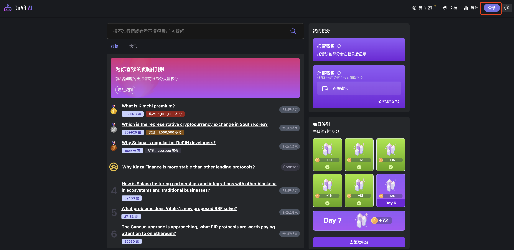
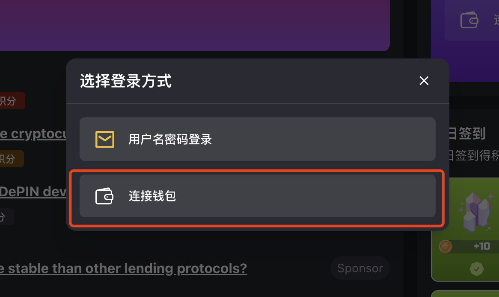
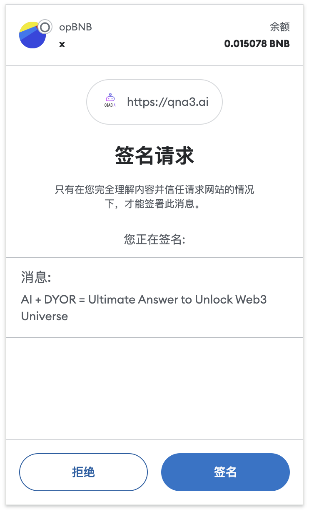
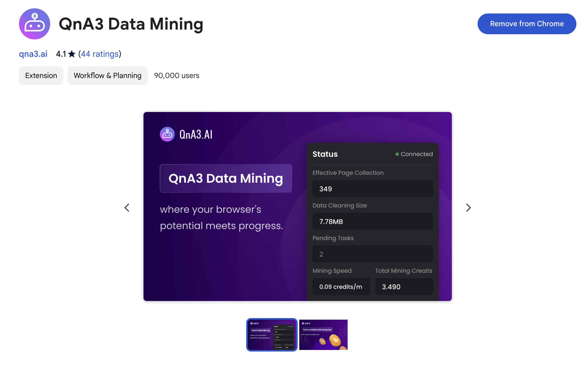
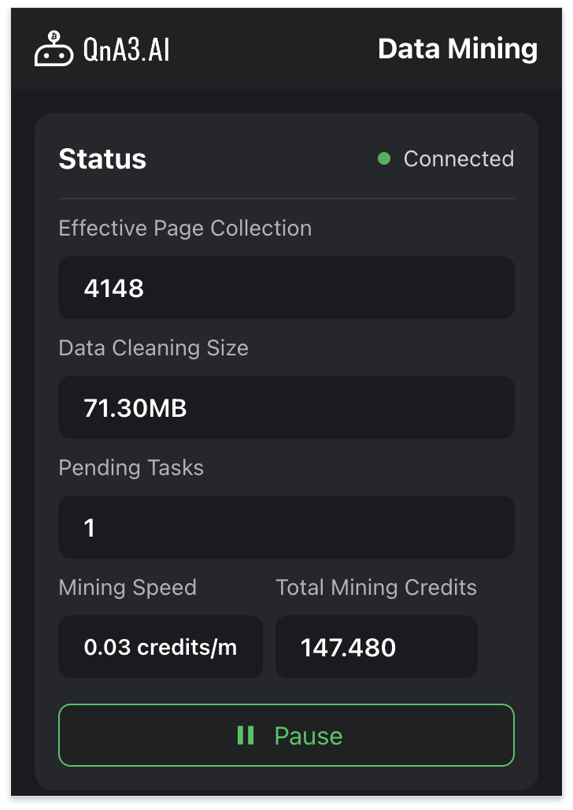

### 项目背景

QnA3.ai 是 AI 驱动的 Web3 问答平台，币安中国 6 周年纪念高潜力项目。目前在全球所有 DApp 中活跃度排前三。

QnA3.ai 是币安 Labs 第六季投资孵化的 AI 项目，投资 400 万美元，目前主要通过签到和挖矿来赚取积分中，后面会根据积分空投 Token，目前积分越多，未来空投越多。

QnA3.ai 有币安作为背书，是一个非常有潜力的项目，未来发行 Token 大概率会上币安交易所，是一只潜力非常巨大的毛，尽量不要错过。

官推： https://twitter.com/qnaweb3

### 挖矿操作方法

挖矿是一个零成本的操作，只需要安装一个 Chrome 插件，就可以开始挖矿，适合所有人。

1. 访问 https://qna3.ai/?code=bB55bXy2 ，使用钱包登录。开梯子可能会 501，可以尝试使用规则模式。

2. Chrome 浏览器中安装 QnA3 Data Mining 插件。

安装地址： https://chromewebstore.google.com/detail/qna3-data-mining/aoacedpgnagknpajfblanffacibnmplp?hl=en

安装完成后固定在浏览器上。

3. 刷新 QnA3 首页页面，会自动开始挖矿，点击浏览器插件，会弹出下图所示的界面，如果没自动开始，点击 Start 按钮挖矿。

