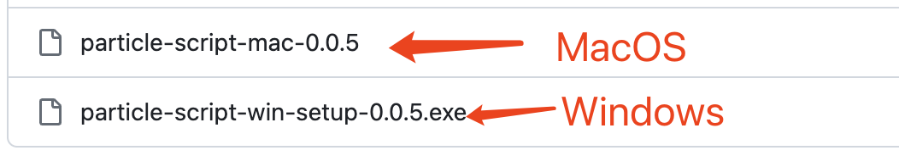
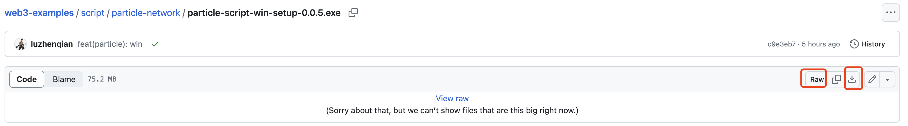
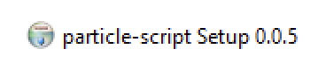
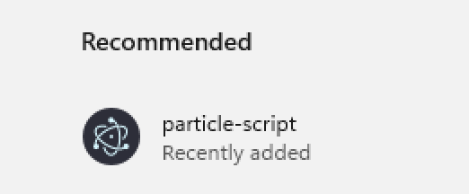
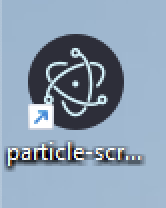
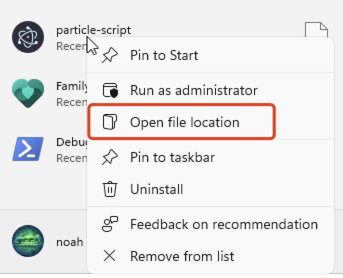
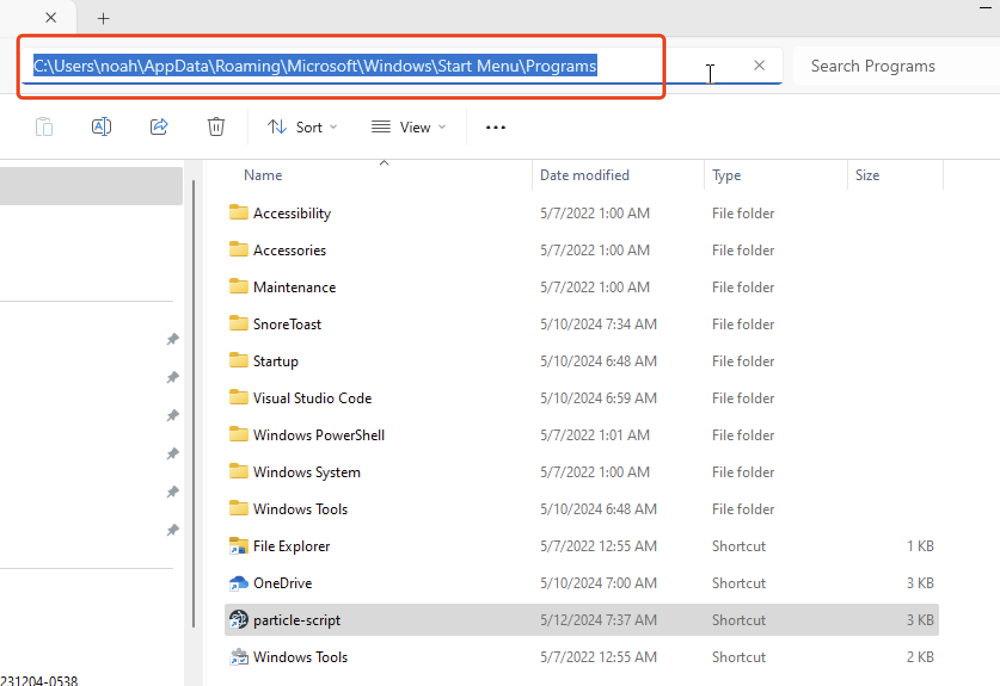
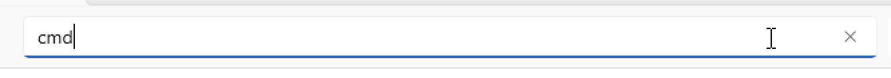
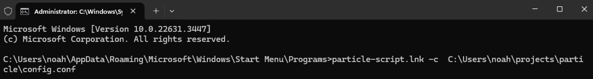

## 支持系统

- [x] MacOS

- [x] Windows

## 下载与安装

找到自己对应的操作系统版本。



点击 rwa 或者下载图标都可以下载。



## 支持分辨率

- [x] 1920x1080

- [x] 1440x900

- [x] 自定义分辨率

分辩率是指物理分辨率，如果不确定分辨率，可以用微信截图截取全屏，就可以看到分辨率。

除默认的两种分辨率外，其他分辨率需要自定义配置。

## 使用前提

请务必仔细阅读本文档，否则可能会无法正常使用。

文档只适用于最新版本的脚本。

1. 确保分辨率在以上支持的范围内。
2. 确保浏览器为 Chrome。
3. 确保浏览器缩放比例为 100%。
4. 确保浏览器隐藏了书签栏。
5. 确保浏览器保持窗口模式下的全屏状态，非 f11 全屏模式。
6. 确保已经在 Particle Network 网站上连接了钱包。
7. 确保已经在 Particle Network 钱包中添加了联系人，脚本会自动选择第一个联系人。
8. 确保已经在 Particle Network 钱包中具有足够的 ETH Seplolia 代币和足够的 USDG 代币。
9. 脚本运行过程中请勿操作鼠标和键盘，否则可能会导致脚本运行失败。
10. 脚本会在运行 100 次后自动停止，如需继续运行，请重新运行脚本。每次运行脚本都会进行系统提示。
11. 隐藏 Dock 栏和 Menu Bar。

## MacOS 使用方法

首先给脚本授权：`chmod +x particle-script-macos-x.y.z`，后面的 `x.y.z` 表示版本号，要根据实际情况替换。

然后运行脚本：`./particle-script-macos-x.y.z`。第一次运行时会有一个系统提示，我们需要在系统设置中手动确认启动。


然后会请求 Accessibility 权限，需要在系统设置中手动开启。


## Windows 使用方法

与 MacOS 不同，Windows 首先需要安装软件才可以运行脚本。

双击下载后的安装包进行安装。



安装后在桌面上会生成一个快捷方式，在最近添加的应用中也会有一个快捷方式。





鼠标右键弹出菜单，找到文件位置。



找到文件位置后，点击文件管理器上方的地址栏。



输入 `cmd`，然后回车。



在弹出的命令行窗口中输入 `particle-script.lnk -c 你的配置文件路径`，然后回车运行。如果你的文件是 `exe` 的话，输入 `particle-script.exe -c 你的配置文件路径`。



## 自定义配置

0.0.4 版本开始支持自定义配置，可以在运行脚本时传入参数，配置参数示例如下：

```json
{
  "elementCursors": {
    "1920": {
      "1080": {
        "wallet": { "x": 1855, "y": 1020 },
        "sendBtn1": { "x": 1540, "y": 580 },
        "addressBook": { "x": 1846, "y": 530 },
        "firstAddress": { "x": 1550, "y": 425 },
        "amount": { "x": 1533, "y": 650 },
        "sendBtn2": { "x": 1695, "y": 915 },
        "verifyBtn": { "x": 1578, "y": 850 },
        "sign": { "x": 1810, "y": 580 }
      }
    }
  },
  "stepWaitTime": {
    "openWallet": 2000,
    "send": 2000,
    "addressBook": 1000,
    "selectAddress": 1000,
    "amount": 1000,
    "send2": 15000,
    "send3": 15000,
    "verify": 2000,
    "sign": 2000,
    "refresh": 5000
  },
  "repeatTimes": 100,
  "amount": 0.0001,
  "verify": true
}
```

- `elementCursors` 表示元素坐标点，可以通过微信截图进行测量，然后替换对应的坐标点。注意第一层对象是分辨率宽度，第二层对象是分辨率高度，第三层对象是元素名称，第四层对象是坐标点。

- `stepWaitTime` 表示每一步操作的等待时间，单位是毫秒。

- `repeatTimes` 表示重复运行次数。

- `amount` 表示交互金额。

- `verify` 表示是否需要验证。5 月 15 日更新后项目方对一些 IP 进行了验证。如果你的 IP 需要验证，需要将该值设置为 `true`。默认不开启。

配置好配置文件后，可以通过 `-c` 参数传入配置文件路径，例如：`./particle-script-macos-x.y.z -c particle.config.json`。

## 更多功能

- [x] 自定义交互金额。
- [x] 自定义交互次数。
- [x] 自定义交互间隔。
- [x] 支持自定义元素坐标点。

有任何问题都可以在仓库中提交 issue，我有时间会尽快回复。

## 更新日志

0.0.6 2024-05-15

- 对每个操作步骤的时间增加了 0.1-1 秒的随机时间，防止被检测。
- 对输入金额增加了 0.00001-0.00009 的随机金额，防止被检测。
- 增加了人机验证的步骤。
