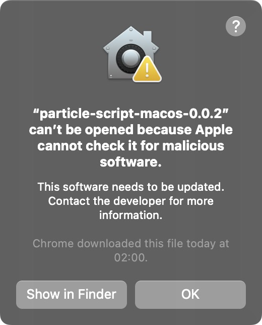
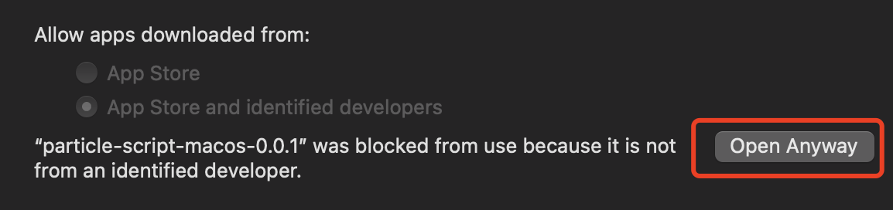
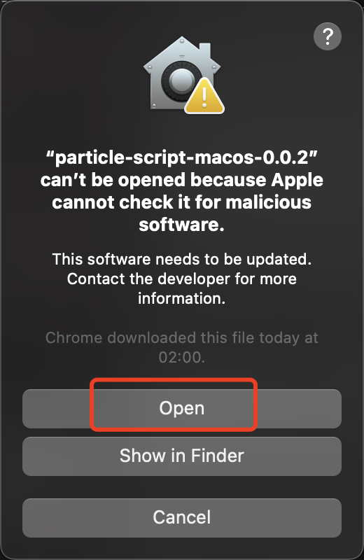
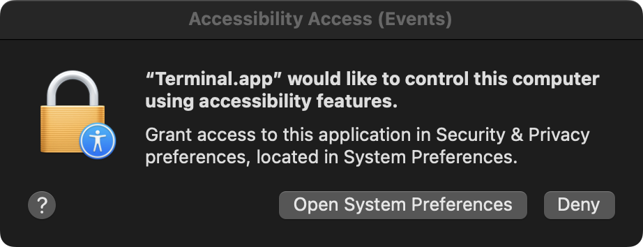
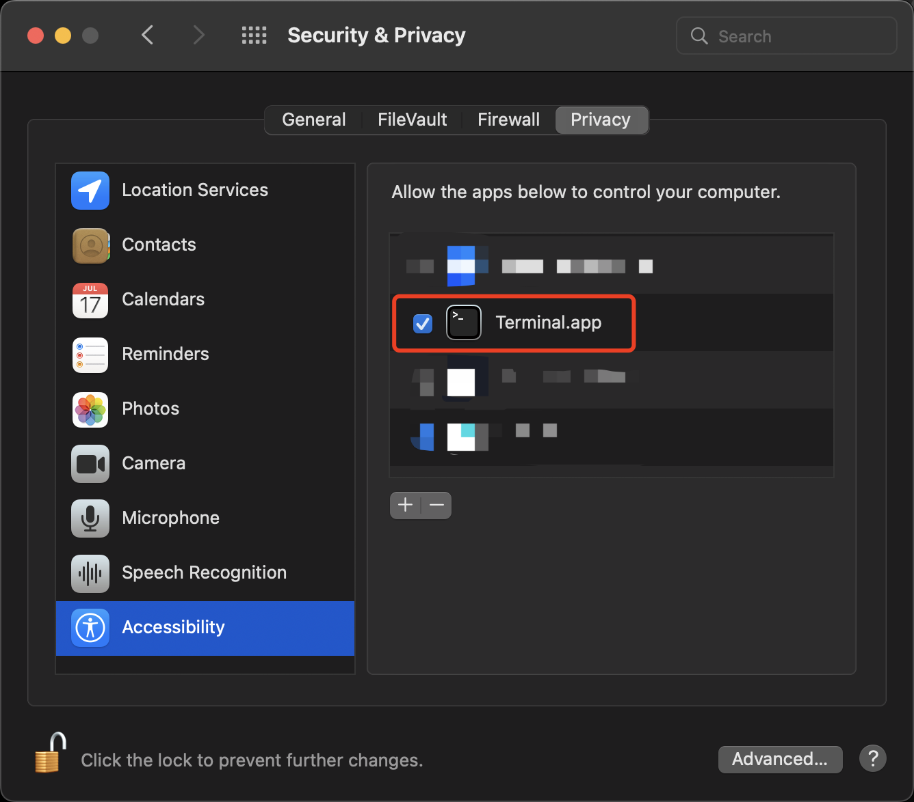

## 支持系统

- [x] MacOS

- [ ] Windows

## 使用前提

请务必仔细阅读本文档，否则可能会无法正常使用。

文档只适用于最新版本的脚本。

1. 确保分辨率为 1920x1080 或 1440x900。（未来会支持更多分辨率）
2. 确保浏览器为 Chrome。
3. 确保浏览器缩放比例为 100%。
4. 确保浏览器隐藏了书签栏。
5. 确保浏览器保持全屏状态。
6. 确保已经在 Particle Network 网站上连接了钱包。
7. 确保已经在 Particle Network 钱包中添加了联系人，脚本会自动选择第一个联系人。
8. 确保已经在 Particle Network 钱包中具有足够的 ETH Seplolia 代币和足够的 USDG 代币。
9. 脚本运行过程中请勿操作鼠标和键盘，否则可能会导致脚本运行失败。
10. 脚本会在运行 100 次后自动停止，如需继续运行，请重新运行脚本。每次运行脚本都会进行系统提示。

## 使用方法

首先给脚本授权：`chmod +x particle-script-macos-x.y.z`，后面的 `x.y.z` 表示版本号，要根据实际情况替换。

然后运行脚本：`./particle-script-macos-x.y.z`。第一次运行时会有一个系统提示，我们需要在系统设置中手动确认启动。

然后会请求 Accessibility 权限，需要在系统设置中手动开启。

## 更多功能

- [ ] 自定义输入钱包。
- [ ] 自定义交互金额。
- [ ] 自定义交互次数。
- [ ] 自定义交互间隔。

有任何问题都可以在仓库中提交 issue，我有时间会尽快回复。
